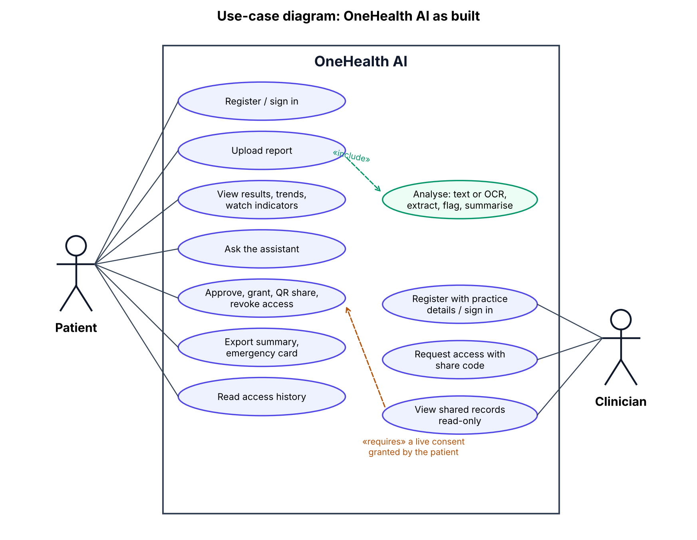
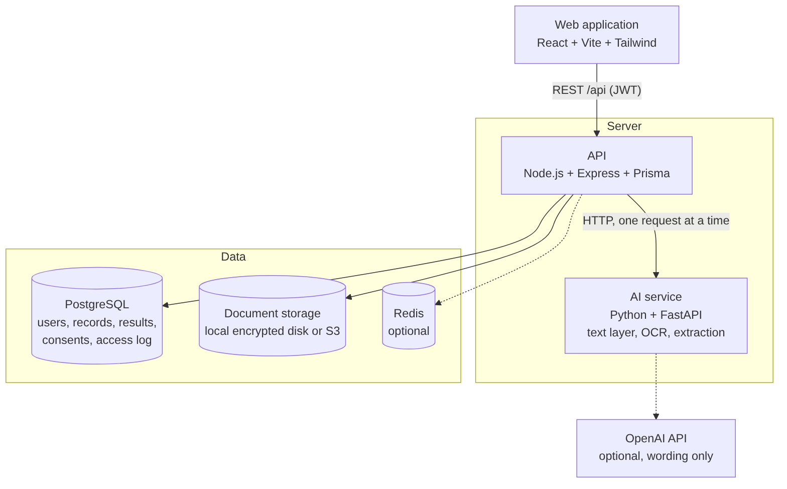
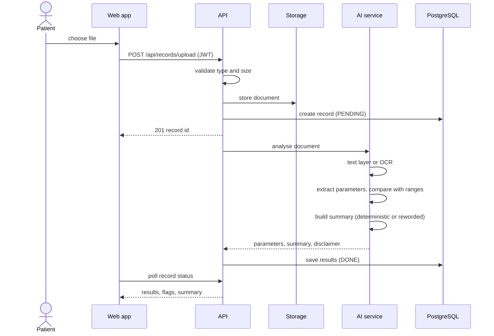
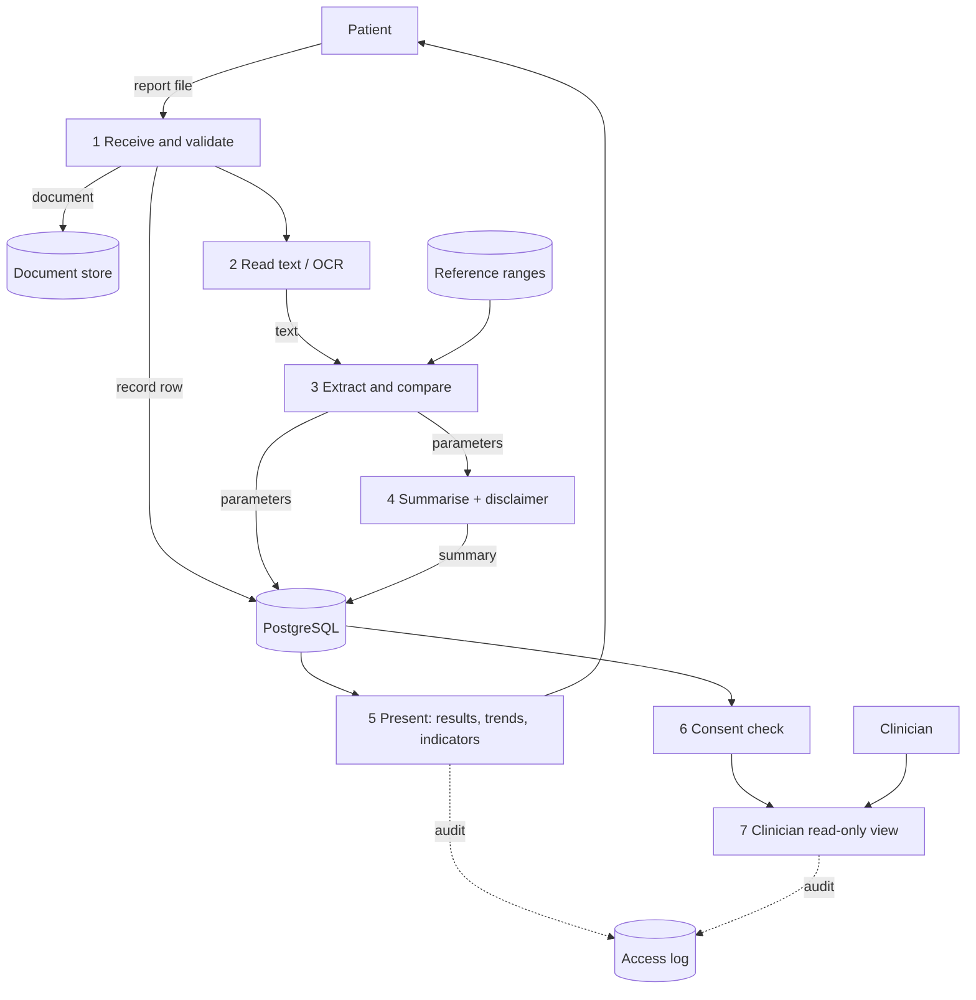
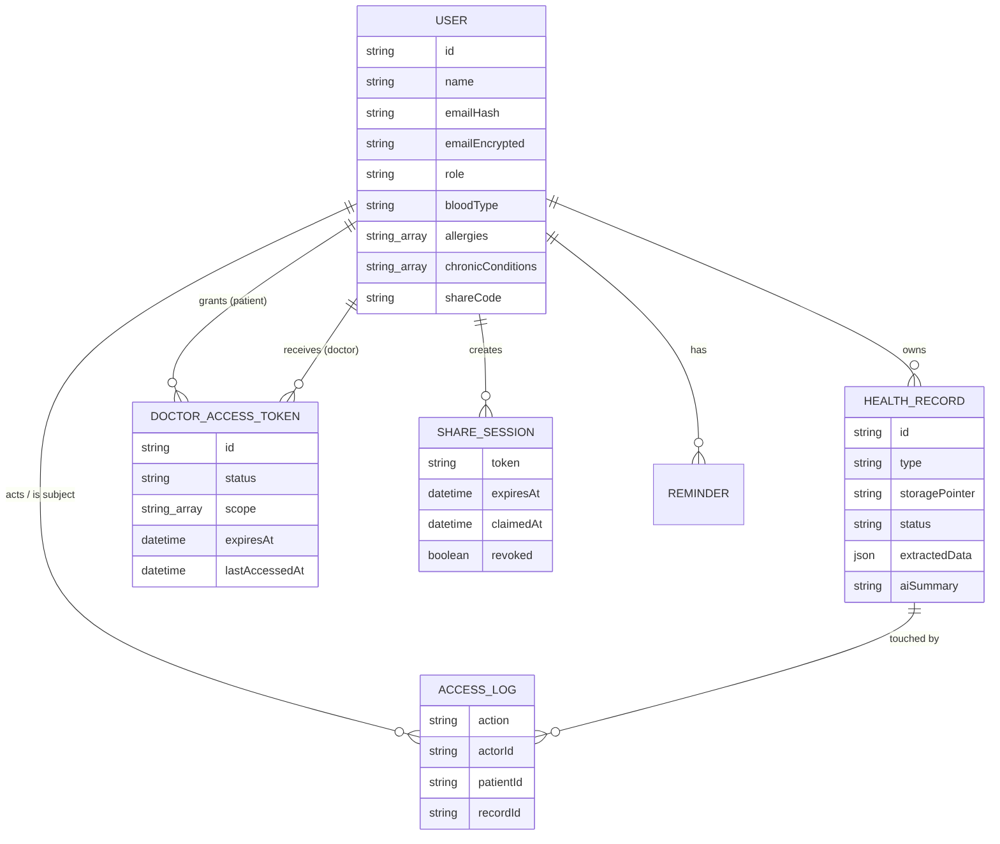
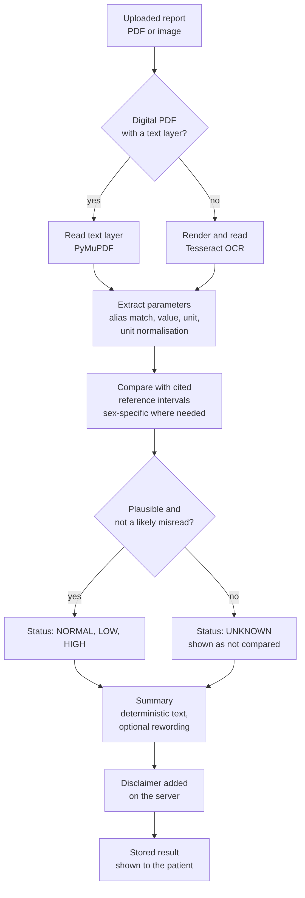
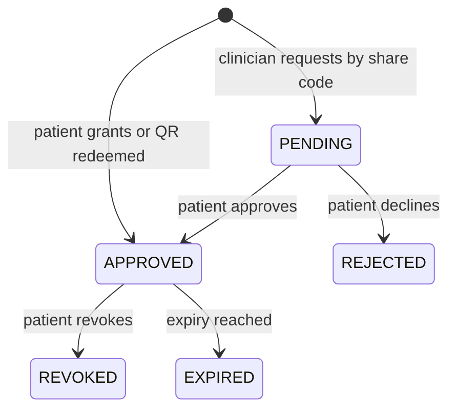

# OneHealth AI — Unified Digital Health Record Platform

**Semester VII dissertation report**

---

## Abstract

Medical reports reach patients as PDFs and photographs in many layouts, with no explanation, and are scattered across laboratories and hospitals. Patients cannot easily see what is outside the normal range, track values over time, or share exactly the records a clinician needs without handing over everything.

This project presents **OneHealth AI**, a web platform on which a patient uploads a laboratory report, has the values read out of it, sees which fall outside published reference intervals, reads a plain-language explanation, follows trends across reports, and shares selected records with a clinician under explicit, time-limited, revocable consent.

The system has three tiers: a React web application, a Node.js and Express API with a PostgreSQL database, and a Python FastAPI service that reads documents (PDF text layer or Tesseract OCR) and extracts 14 laboratory parameters. Extraction is **deterministic**: values are matched by name, parsed, unit-normalised and compared with cited reference intervals. A language model is never allowed to read or produce a number; it may only re-word findings already extracted, and the system works without one. Doubtful values are shown as "not compared" instead of being given a confident status. The system is a decision-support aid and does not diagnose, prescribe or treat. Every explanation carries a disclaimer.

On 1,090 synthetic values with exact ground truth, digital PDFs were read with 100% recall and value accuracy, and clear scans with 99.1% recall and 97.3% value accuracy, with no wrong value shown under a confident status. Photographs of poor quality were read with 58.7% value accuracy and 7.2% of values were wrong with a confident status; this limit is reported, and the interface warns the user to compare scanned values with the original. 196 automated assertions and the benchmark pass.

**Keywords:** Digital health records, Optical character recognition, Medical information extraction, Clinical natural language processing, Consent-based data sharing, Role-based access control, Decision support, Patient-centred health.

---

# Chapter 1: Introduction

## 1.1 Background

A person's health information is produced in many places: a blood test at one laboratory, a prescription at a clinic, a discharge summary at a hospital. Most of it reaches the patient as a paper report, a PDF or a photograph. Electronic health record systems store data inside one provider, are often not interoperable, and rarely let the patient see an explained, consolidated view. A patient who changes city or doctor typically carries a folder of papers.

Laboratory reports are the most common and most structured of these documents. They list tests, values, units and reference intervals, but the layout differs between laboratories, and the interpretation is left to the reader. Studies of patients who receive results through online portals found that most receive no explanation with the result, that many search the internet for one, and that those with abnormal results are more likely to report negative emotions and to call their doctor [1].

Two recent technologies make a patient-centred solution feasible. Optical character recognition (OCR) and rule-based and statistical language processing can turn a report into structured data, and large language models can phrase information in plain language. The second is also a danger: language models produce fluent text that can contain invented content, and in a medical setting an invented value is a harm, not an inconvenience [6][7].

## 1.2 Motivation

The motivation is to give the patient a single, understandable and controllable record without creating new risks:

- **Fragmentation.** Reports live in separate places and formats, so history is hard to assemble when a clinician asks for it.
- **Opacity.** A report states values and ranges but not what they mean for the reader, and an unexplained abnormal value causes worry [1].
- **Control.** Sharing a record usually means handing over a file with no way to limit what is seen, for how long, or to find out afterwards who looked.
- **Trust.** Any system that explains medical data must not invent it, must say when it is unsure, and must not pretend to diagnose.

## 1.3 Scope of the project

The system lets a patient register, upload reports (PDF, JPEG, PNG, WebP or TIFF), and see extracted laboratory values for 14 tests (haemoglobin, red and white cell counts, platelets, fasting glucose, HbA1c, creatinine, TSH, total cholesterol, LDL, HDL, triglycerides, ALT and AST), their status against cited reference intervals, a plain-language summary, trends across reports and a comparison of two reports. It provides watch indicators based on published guideline thresholds, an emergency-card QR, a PDF health summary, in-app reminders and an assistant that answers questions from the patient's own results and refuses to diagnose. A clinician registers with practice details, requests access with the patient's share code, and sees only what the patient has approved, read-only, for the approved time. Every access is recorded and visible to the patient.

**Not in scope:** appointment booking, disease prediction, native mobile apps, payments, integration with India's ABDM registry, email or SMS delivery, and production cloud hosting. Each is listed with its current state in the requirements specification (`docs/SRS.md`).

## 1.4 Brief description of the project undertaken

OneHealth AI is a three-tier web application of roughly 15,600 lines of TypeScript and Python, excluding tests and scripts. A patient uploads a document; the API validates and stores it and creates a record; the AI service reads the document, extracts and classifies the values and builds a summary; the API stores the result and the web application shows it, polling the processing status. Authorisation is enforced on the server for every request, including every clinician read, against a live consent. The design decisions that distinguish the project are:

1. Extraction is deterministic, and a language model is optional and limited to wording.
2. A value that might have been misread is shown as "not compared" instead of being flagged.
3. Nothing is invented: unset profile fields read "Not provided", and there is no composite health score.
4. The system runs with no cloud account, and degrades gracefully when optional components are absent.
5. Accuracy is measured, including the rate of wrong values shown with confidence.

## 1.5 Organisation of the report

- **Chapter 1: Introduction.** Background, motivation, scope and a brief description of the project.
- **Chapter 2: Literature survey.** Existing work on patient access to results, extraction from laboratory reports, clinical language processing, language models in medicine, access control and interoperability, and the gap this project addresses.
- **Chapter 3: Project design.** The problem statement, architecture, objectives, the processing method and the safety and security design.
- **Chapter 4: Implementation and experimentation.** The technology stack, the modules, the evaluation method, the results and their limits.
- **Chapter 5: Conclusions and further work.**

---

# Chapter 2: Literature survey

## 2.1 Patients and their test results

Giardina et al. [1] interviewed 95 adults who had received test results through an online portal. Nearly two thirds received no explanatory information with their result, and 46% searched online for more. People with abnormal results were more likely than those with normal results to report negative emotions (56% against 21%) and to call their physician (44% against 15%). The authors conclude that a portal alone does not help patients interpret and act on results.

*Relevance.* This is the problem OneHealth AI addresses: results exist, but patients are left to interpret them alone. It also sets the safety requirement. A tool that explains abnormal results reaches people who are already anxious, so the explanation must be accurate, must not diagnose, and must say when it is unsure.

## 2.2 Extracting laboratory values from reports

Ma et al. [2] built a pipeline with an OCR module and an information-extraction module that turns scanned paper laboratory reports into a table of test name, result, unit and reference range. On 153 reports from Peking University First Hospital the OCR module averaged 0.93 accuracy (0.95 at character level), and the extraction module reached an F1 score of 0.86 (precision 0.90, recall 0.83). A conditional-random-field method outperformed a rule-based baseline, and reference-range extraction scored lower than the other entity types. The main error sources were poor scan quality, misplaced lines and multi-column layouts. Average inference time was 0.78 s per report on one CPU.

Smith [3] describes the Tesseract engine, the OCR component OneHealth AI uses, covering its line finding, feature classification and adaptive classifier.

*Relevance and difference.* Ma et al. report extraction quality as precision, recall and F1. OneHealth AI additionally counts **silent wrong values** (a wrong number shown with a confident HIGH, LOW or NORMAL status), because for a patient-facing tool that is the harmful error and F1 hides it. Its own benchmark (`docs/EVALUATION.md`) reports it separately. OneHealth AI also reads digital PDFs from their text layer, which avoids OCR error entirely for the common case. Its extraction is rule-based, so the CRF result in [2] is a reasonable direction for future work, not something this project claims to match.

## 2.3 Negation and context in clinical text

A mention of "hypertension" in a note does not mean the patient has it. Chapman, Chu and Dowling [4] present ConText, a regular-expression algorithm that extends NegEx to assign negation, temporality (historical or hypothetical) and experiencer (someone other than the patient) to clinical conditions in emergency department reports. It performed very well on negation, fairly well on hypothetical and historical status, and moderately well on identifying other experiencers. Eyre et al. [5] released medspaCy, an open-source Python library built on spaCy that combines rule-based and machine-learning methods for clinical text and includes context analysis of the kind in [4].

*Relevance.* OneHealth AI's clinical NER uses spaCy with medspaCy's context component, and a rule-based engine of the same output shape when those libraries are absent. It cross-checks the two detectors and lets either one suppress a mention, because wrongly suppressing a finding costs a line in a list while wrongly asserting a denied diagnosis records something false. Verified: the spaCy engine runs on Python 3.12 (30 of 30 tests pass); on Python 3.13 spaCy has no wheels and the rule-based engine takes over.

## 2.4 Language models in healthcare, and their errors

Thirunavukarasu et al. [6] review how large language models are built, their early clinical and biomedical uses, and their benefits and drawbacks for healthcare. A medRxiv preprint [7] evaluated 18 configurations of a language-model note-generation workflow on clinician-annotated output (450 notes). It found that 1.47% of note sentences contained hallucinations, 44% of those classed as major, and that 3.45% of transcript sentences were omitted, 16.7% of them major. Iterating on prompts and workflow reduced the errors substantially.

*Relevance.* Even a carefully engineered workflow produced some hallucinated sentences, so OneHealth AI never lets a model read or produce the numbers. Values are extracted deterministically, and a model may only reword findings already extracted. The assistant discards a reworded answer if it introduces a number the deterministic draft did not contain, and refuses requests for diagnosis, prescription or prognosis before composing any answer.

## 2.5 Access control, consent and data sharing

Sandhu et al. [8] define the role-based access control models widely used to separate what, for example, a patient, a clinician and an administrator may do. Azaria et al. [9] propose MedRec, a decentralised blockchain system for managing access to electronic medical records, giving patients a tamper-resistant history and control over sharing across providers. India's Ayushman Bharat Digital Mission keeps health data with the provider that holds it and lets a user of that data obtain it only with the patient's consent through a consent manager that is "data-blind by design" [10].

*Relevance and difference.* OneHealth AI combines role-based checks with a patient-controlled consent lifecycle (pending, approved, rejected, revoked, expired), time-limited grants with a scope, and single-use QR sessions, and it records who accessed whose data. It does not use a blockchain; an ordinary transactional database with a server-side check on every request meets the project's requirements with one fewer moving part. It is also not an ABDM participant: only the ABHA identifier is stored, and no registry or consent-manager calls are made.

## 2.6 Interoperability and architecture

Mandel et al. [11] describe SMART on FHIR, a standards-based platform for building apps that run across electronic health record systems.

*Relevance.* OneHealth AI uses its own JSON model, not FHIR resources, so records cannot yet be exchanged with a hospital system. Mapping extracted values to FHIR Observation resources is the natural next step and is listed under further work.

## 2.7 Reference standards used in the project

Reference intervals and guideline thresholds are fixed constants with a named source, not model output: the World Health Organization's haemoglobin thresholds for anaemia [12], the American Diabetes Association criteria for fasting glucose and HbA1c, and the NCEP ATP III classification for lipids. The source for each value is stored beside it in `ai-service/app/data/reference_ranges.py`, so any HIGH or LOW can be traced.

## 2.8 Comparison and research gap

| Work | Reads values from reports | Handles negation / context | Patient-controlled sharing | Explains results to patients | Limits model errors by design | Measures silent wrong values |
|---|---|---|---|---|---|---|
| Giardina et al. [1] | — (study of portals) | — | — | Shows the need | — | — |
| Ma et al. [2] | Yes (scans) | — | — | — | — | No (reports F1) |
| ConText / medspaCy [4][5] | — (clinical text) | Yes | — | — | — | — |
| MedRec [9] | — | — | Yes | — | — | — |
| SMART on FHIR [11] | — | — | Via authorisation | — | — | — |
| LLM note generation [6][7] | — | — | — | Generates text | Measures hallucination | — |
| **OneHealth AI** | Yes (PDF text layer and OCR) | Yes (spaCy + medspaCy, with fallback) | Yes (consent lifecycle, QR) | Yes (deterministic, optional rewording) | Yes (model never produces numbers) | **Yes** (`docs/EVALUATION.md`) |

A dash means the work does not address that dimension as far as its abstract and summary indicate, not that it is deficient. The cells for OneHealth AI are what the repository demonstrates.

**Gap.** The works above each address one piece: extraction, negation, access control, or the risks of generated text. We found none in this survey that joins extraction from a patient's own reports, deterministic comparison with cited reference intervals, a patient-controlled consent flow and an assistant that cannot invent a value, and then measures how often the extraction is wrong without showing it. That is the contribution of OneHealth AI. The claim is limited by what was surveyed: ten sources, not the whole literature.

## 2.9 Objectives of the proposed system

1. Store a patient's medical reports centrally and securely.
2. Extract laboratory values from digital and scanned reports deterministically, compare them with cited reference intervals, flag values outside range and explain them in plain language with a disclaimer.
3. Give the patient a dashboard of results, trends, comparison and watch indicators.
4. Let the patient share records with a clinician only through explicit, time-limited, revocable consent, with every access recorded.
5. Protect personal data with hashing, encryption at rest, token authentication and role-based authorisation.
6. Answer questions only from the patient's own results, and refuse to diagnose.
7. Measure extraction accuracy and report its failures.

---

# Chapter 3: Project design

## 3.1 Introduction

This chapter states the problem, presents the architecture and describes how reports are processed and how safety, privacy and consent are enforced. The design favours a small number of well-understood components over breadth: every number shown to a patient must be traceable to a document they uploaded, and every access to a record must be authorised, recorded and revocable.

## 3.2 Problem statement

Patients receive laboratory reports in inconsistent formats, without explanation, spread across providers. They cannot readily see which values are outside range, how a value has changed over time, or control who sees a record and for how long. Existing record systems store data without making it understandable to the patient, and an automated explainer that invents or misreads a value could cause real harm.

The problem addressed is to design and build a system that:

- Stores a patient's reports centrally and securely.
- Extracts laboratory values from digital and scanned reports reliably, and says when it cannot.
- Compares values with published reference intervals and explains them in plain language, without diagnosing.
- Lets the patient share records with a clinician only through explicit, time-limited and revocable consent, with every access recorded.

{width=5.2in}

## 3.3 System architecture

The architecture has three tiers (Figure 3.2).

{width=6in}

1. **Presentation tier.** A React single-page application (Vite, Tailwind CSS). It calls the API over REST, keeps the short-lived access token in memory and relies on an HttpOnly cookie for the refresh token.
2. **Application tier.** A Node.js and Express API with TypeScript and Prisma. It handles authentication, role-based and ownership checks, consent, file storage, auditing, PDF export and trend computation. It calls the AI service over HTTP.
3. **AI tier.** A stateless Python FastAPI service. It reads documents, extracts and classifies values and produces summaries and assistant answers. It has no access to the database: the API gives it only the data for one request.

**Data tier.** PostgreSQL holds users, records, extracted results (as JSON columns), consents, share sessions, reminders and the access log. Documents are stored behind a driver interface: encrypted local disk by default, with an S3 driver implemented. Redis is optional, used for rate limiting and token state, and the API uses an in-process store when it is absent.

**Process flow (Figure 3.3).** The patient uploads a file; the API validates type and size, stores the document, creates a record in the PENDING state and returns immediately; the AI service reads the document, extracts and classifies the values and builds the summary; the API saves the result and sets the state to DONE; the web application, polling the status, displays the result.

{width=6in}

{width=6in}

{width=6in}

## 3.4 Objectives

**Primary.**

- Provide a centralised, secure store of a patient's medical reports.
- Extract laboratory values deterministically and compare them with cited reference intervals.
- Explain results in plain language with a disclaimer, without diagnosing or prescribing.
- Provide consent-based, time-limited, revocable sharing with a clinician, with an audit trail.

**Secondary.**

- Show trends, comparison and watch indicators on a patient dashboard.
- Answer questions grounded in the patient's own results, and refuse to diagnose.
- Offer an emergency-card QR, a PDF summary and reminders.
- Measure extraction accuracy and report its failures.

**Longer term.**

- Map extracted values to FHIR resources and integrate with India's ABDM, with sandbox credentials.
- Verify clinician registration numbers against a council register.
- Offer an installable mobile experience and outbound notifications.

## 3.5 Deterministic medical data processing

The earlier draft of this chapter described supervised disease prediction. The system built does not predict disease. Its pipeline reads a document and reports what it says (Figure 3.6).

**Step 1: obtain text.** A digital PDF is read from its text layer with PyMuPDF. A scan or image is rendered and read with Tesseract OCR [3]. The result records which path was used.

**Step 2: extract parameters.** For each of 14 recognised parameters, a table of aliases (for example "Hb", "Haemoglobin", "Glycosylated hemoglobin") finds the test name in a line; the number, its unit and any printed range are parsed from that line. Units are normalised, including Indian laboratory conventions such as lakh notation and `/cumm`, so that 2,45,000 /cumm becomes 245 x10³/µL. Candidates are ignored when they are part of a different test's name (for example "LDL cholesterol" must not be read as total cholesterol) or when a number begins a range or follows a comparison sign.

**Step 3: classify.** Each value is compared with a stored reference interval chosen by the sex printed on the report where intervals differ. The result is NORMAL, LOW, HIGH or UNKNOWN, with a confidence and the source line. The intervals are fixed constants with a named source (WHO [12], American Diabetes Association, NCEP ATP III, standard references) in `reference_ranges.py`, so any flag can be traced.

**Step 4: fail safe.** A value outside a physiologically plausible window, or next to characters that OCR commonly misreads, is reported as UNKNOWN and shown to the patient as "not compared". The interface adds a notice on every OCR-read report asking the patient to compare values with the original.

**Step 5: explain.** A deterministic generator writes the summary from the extracted values. If an OpenAI key is configured, a model may re-word it, and the system discards the model text if it contains a number the deterministic text did not. A disclaimer is appended on the server, so a client cannot drop it.

**Step 6: clinical entities.** Medications, conditions, procedures and allergies in free text are read with spaCy and medspaCy's context component [5] where installed, and a rule-based engine of the same output shape otherwise. Either detector may suppress a mention that is negated, historical, hypothetical or about a family member [4], because wrongly suppressing a finding costs a line in a list while wrongly asserting a denied diagnosis records something false.

{height=7in}

**Watch indicators.** The newest usable value of each test is compared with guideline thresholds (blood sugar, haemoglobin, cholesterol and blood fats, and out-of-range kidney, thyroid, liver and blood-count markers). Each indicator names its values, dates and guideline, is worded as "worth keeping an eye on" or "worth discussing with a clinician", never names a diagnosis, and states what is not assessed (blood pressure, and anything not printed on a report).

## 3.6 Why the system does not predict disease

Predicting a disease from symptoms would make the system a diagnostic tool. It would need a labelled clinical dataset, clinical validation and regulatory consideration far beyond this project, and an unvalidated prediction presented to a patient is a safety risk. The assistant therefore refuses requests for diagnosis, prescription, treatment or prognosis before composing any answer, and says why. Decision support here means showing the patient what their documents say and where values fall relative to published thresholds, and pointing them to a clinician.

## 3.7 Security, privacy and consent design

- **Authentication.** Passwords are hashed with bcrypt (cost 12). A 15-minute JWT access token and a 7-day refresh token in an HttpOnly cookie, rotated on use with the old token blacklisted.
- **Authorisation.** Role-based checks [8] (patient, clinician, administrator; administrator cannot be self-assigned) plus per-record ownership checks on every request. Clinician endpoints are read-only.
- **Data protection.** Email and phone are encrypted at rest with AES-256-GCM, with a separate keyed hash for lookup. No public document URL exists; each fetch re-checks ownership or consent.
- **Consent lifecycle.** PENDING, APPROVED, REJECTED, REVOKED, EXPIRED (Figure 3.7). A grant has a scope (records, trends, profile) and an expiry from one to thirty days, checked at read time. A clinician can find a patient only by a rotatable share code, not by name or email.

- **QR sharing.** A short-lived (5 to 60 minutes), single-use random token that creates an ordinary revocable consent; it carries no identifying or medical data.
- **Audit.** Every read records who acted and whose data it was, and the patient can read the log.
- **Errors.** No stack traces or internals in responses; secrets come only from validated environment variables, and the service refuses to start in production with development secrets.

{width=6in}

---

# Chapter 4: Implementation and experimentation

## 4.1 Introduction

This chapter describes the technology used, the implemented modules, the evaluation method and the results. All reports used in evaluation are synthetic; no real patient data is used anywhere in the project.

## 4.2 Technology stack

| Layer | Technology |
|---|---|
| Web application | React 19, Vite, Tailwind CSS 4, TypeScript, React Router; charts drawn as inline SVG |
| API | Node.js, Express 5, TypeScript, Prisma 6 with the PostgreSQL driver adapter, zod validation, JSON Web Tokens, bcrypt, helmet, multer, PDFKit, qrcode |
| AI service | Python, FastAPI, PyMuPDF, Tesseract 5 through pytesseract, spaCy and medspaCy (optional), OpenAI API (optional) |
| Data | PostgreSQL 16; local encrypted disk or AWS S3 for documents; Redis optional |
| Quality | pytest (30 tests), three end-to-end suites (166 assertions), a benchmark script, GitHub Actions CI |
| Deployment files | Dockerfiles for the three services and a compose file for the whole stack (written and validated; images not yet built) |

The earlier draft named MongoDB as the primary database. The system uses PostgreSQL, with extracted data in JSON columns, so that consent, records and results sit in one transactional store with one fewer operational dependency.

## 4.3 Implemented modules

### 4.3.1 Authentication and identity
Registration as a patient or a clinician (with speciality, clinic and registration number), login with rotating refresh tokens, and rate limiting on sign-up, login and sensitive actions. A one-time-password endpoint exists, but delivery is a console stub, so the interface does not offer it, and password reset by email is not implemented.

### 4.3.2 File upload and storage
Drag-and-drop upload of one or several files (up to ten at a time), validated by type and size in the browser and again on the server. Documents are written through a storage driver interface to encrypted local disk; an S3 driver is implemented but has not been exercised against a real bucket. Metadata and extracted data are stored in PostgreSQL.

### 4.3.3 AI report processing
The pipeline of section 3.5. The service returns for each parameter the value, unit, reference interval and its basis, status, confidence, the source line and a patient-friendly label. A failed analysis can be retried without losing the upload.

### 4.3.4 Dashboard and visualisation
Totals, latest findings, items needing attention (access requests, abnormal values, overdue reminders, failed analyses), watch indicators, recent records, reminders and an access-history panel; a trends page with a chart per test and a shaded reference band; a comparison of two reports; search and filter by type, status, tag and date.

### 4.3.5 Health assistant
Answers questions about the patient's own values from a context built from that patient's rows only, cites the source report, labels whether the answer was deterministic or model-worded, and refuses diagnosis, prescription, treatment and prognosis.

### 4.3.6 Consent and clinician access
Requests by share code, approval with scope and duration, direct grants, QR sharing, revocation, a clinician view limited to live consents, and the access log.

### 4.3.7 Emergency card, export and reminders
A QR holding only the details the patient chooses, readable offline; a PDF health summary stamped with the disclaimer; in-app reminders.

## 4.4 Execution flow and experimental setup

**End-to-end verification.** Three suites call the running API directly, so a pass shows that the server enforces authorisation, not that the interface hid a button: a core suite (42 assertions: registration, login, upload, analysis, document access control, deletion), a consent suite (95: consent lifecycle, QR sharing, assistant, trends, export, reminders, rate limits) and a features suite (29: watch indicators, emergency card). Thirty unit tests cover extraction, units, OCR misreads, clinical language processing and assistant safety.

**Extraction benchmark.** A script (`ai-service/scripts/benchmark.py`, fixed random seed) generates synthetic reports with exact ground truth in three layouts (table, inline, flagged), two wordings (test names the extractor lists, and phrasings written without consulting it) and varied unit styles. They are rendered as digital PDFs, as images with light degradation (noise, slight blur, compression) and as phone-photo-style images with heavy degradation, and each is analysed through the service. Metrics: recall; value accuracy; status accuracy; precision; and **silent wrong values**, a wrong number shown with a confident HIGH, LOW or NORMAL status, which is the unsafe failure. Implausible misreads shown as UNKNOWN, and missed values, are counted separately because neither misleads the patient.

## 4.5 Analysis of results

### 4.5.1 Extraction accuracy

| Input | Documents | Values | Recall | Value accuracy | Silent wrong values |
|---|---|---|---|---|---|
| Digital PDF (text layer) | 60 | 657 | 100.0% | 100.0% | 0 |
| Scan, light degradation (OCR) | 20 | 225 | 99.1% | 97.3% | 0 |
| Phone-photo style, heavy degradation (OCR) | 20 | 208 | 75.0% | 58.7% | 15 (7.2%) |

Test names the extractor does not list were read as well as those it does: on digital PDFs 100% for both, and on light scans 100% recall for the unlisted phrasings against 98.4% for the listed ones, so the 100% digital result is not an artefact of tuning to its own wordings.

The benchmark found real faults, which were fixed: HbA1c names it did not recognise, scientific-notation count units written with unusual characters, an LDL value read as total cholesterol, a value read from a "(HbA1c)" qualifier, numbers that began a printed range, and values glued to a letter by OCR. After the fixes, accuracy on light scans rose from 87.6% to 97.3%.

### 4.5.2 Latency

| Input | Median | 95th percentile |
|---|---|---|
| Digital PDF | 19 ms | 24 ms |
| Scan, light degradation | 3.6 s | 4.1 s |
| Phone-photo style | 2.6 s | 2.8 s |

These are in-process timings of the analysis for one page on the test machine, and exclude upload and polling. The plan's target of completing a report in under 20 seconds is met for these inputs.

### 4.5.3 Test results

| Suite | Assertions | Result |
|---|---|---|
| AI service tests | 30 | Passed |
| Core smoke suite | 42 | Passed |
| Consent and sharing suite | 95 | Passed |
| Features suite | 29 | Passed |
| Backend typecheck, frontend build | n/a | Clean |

The spaCy and medspaCy engine was also run, under Python 3.12, with the same 30 tests passing. On Python 3.13 those libraries have no installable release and the rule-based engine runs instead.

### 4.5.4 Sample output

For the synthetic report `sample-blood-report-abnormal.pdf` (female, text-layer PDF, analysed in 38 ms), 14 values were extracted and 10 flagged:

| Test | Value | Unit | Reference interval | Status |
|---|---|---|---|---|
| Hemoglobin | 10.4 | g/dL | 12.0–15.0 | LOW |
| Platelet count | 245 | 10³/µL | 150–450 | NORMAL |
| Red blood cell count | 3.9 | 10⁶/µL | 4.1–5.1 | LOW |
| White blood cell count | 12.8 | 10³/µL | 4.0–11.0 | HIGH |
| Fasting blood glucose | 126 | mg/dL | 70–99 | HIGH |
| HbA1c | 6.8 | % | 4.0–5.6 | HIGH |
| Serum creatinine | 0.9 | mg/dL | 0.6–1.1 | NORMAL |
| HDL cholesterol | 38 | mg/dL | above 50 | LOW |
| LDL cholesterol | 168 | mg/dL | below 100 | HIGH |
| Total cholesterol | 248 | mg/dL | below 200 | HIGH |
| Triglycerides | 210 | mg/dL | below 150 | HIGH |
| ALT (SGPT) | 64 | U/L | 7–56 | HIGH |
| AST (SGOT) | 38 | U/L | 10–40 | NORMAL |
| TSH | 3.2 | mIU/L | 0.4–4.0 | NORMAL |

The generated summary states that 10 of 14 values are outside the typical range, groups them (complete blood count, diabetes profile, lipid profile, liver function), explains each in plain language without naming a diagnosis, and ends: *"AI-generated information is for informational purposes only and does not constitute medical diagnosis or treatment. Please consult a qualified healthcare professional for interpretation of your results."*

## 4.6 Limitations and threats to validity

- **Synthetic data.** The benchmark reports are generated by the project team. The results support "reliable on the layouts tested", not "accurate on any laboratory's report". Wider validation needs real reports used with consent and ethical approval.
- **Photographs.** At phone-photo quality, 7.2% of values were wrong yet shown with a confident status, mainly through digit substitutions that cannot be detected from the text alone. The interface warns on every scan and shows doubtful values as "not compared". A future cross-check against the status printed on the report would reduce this.
- **Coverage.** Fourteen tests, English reports, adult patients.
- **Storage.** The S3 driver has not been run against a real bucket.
- **Clinician verification.** The registration number is stored and shown to the patient; it is not verified against a medical council register.
- **Deployment.** The container files have not been built or hosted, and no load test has been run.
- **spaCy engine.** The default installation on Python 3.13 uses the rule-based engine.

## 4.7 Summary

This chapter described the implemented modules, the evaluation method and the measured results. Digital reports are read reliably; scans are read reliably when clear and with measured, reported risk when not. Chapter 5 concludes and sets out further work.

---

# Chapter 5: Conclusions and further work

## 5.1 Conclusions

OneHealth AI demonstrates that a patient can upload a laboratory report and receive extracted values, status against cited reference intervals, a plain-language explanation and trends, and share records with a clinician under consent that is explicit, time-limited, revocable and audited, while keeping the system from inventing or silently misreporting a number.

The main achievements are:

1. A deterministic extraction pipeline for 14 laboratory parameters that reads digital reports perfectly on the benchmark and clear scans at 97.3% value accuracy, and refuses to guess when a value is implausible.
2. A measurement discipline that reports the unsafe failure (a wrong value shown confidently) separately from missed values, and that found and fixed six extractor faults.
3. A consent and access design enforced on the server for every request, verified by 166 end-to-end assertions that call the API directly.
4. A safety stance built into the design: no diagnosis, no model-generated values, a disclaimer on every explanation, and an assistant that refuses clinical requests.
5. A system that runs locally with no cloud account and degrades gracefully when optional components are absent.

The project did not build appointment scheduling or disease prediction. The latter was a deliberate decision (section 3.6).

## 5.2 Scope for further work

1. **Validate on real reports** with consent and ethical review, and widen test coverage beyond 14 parameters.
2. **Reduce silent errors on photographs**, by cross-checking an extracted value against the status or range printed on the report, and by image pre-processing such as skew and perspective correction.
3. **Deploy and test at load.** Build the container images, host them, exercise the S3 driver against a real bucket and run a load test.
4. **Interoperability.** Map extracted values to FHIR Observation resources [11] and integrate with the ABDM consent manager [10] using sandbox credentials.
5. **Clinician verification** against a medical council register.
6. **Notifications and account recovery.** Email and SMS delivery for reminders and consent events, password reset and authenticator-app two-factor sign-in.
7. **Trend and risk indicators** that include blood pressure once a device or entry method exists.
8. **A mobile or installable app** with offline viewing of the emergency card and recent reports.

---

# Bibliography

[1] T. D. Giardina, J. Baldwin, D. T. Nystrom, D. F. Sittig and H. Singh, "Patient perceptions of receiving test results via online portals: a mixed-methods study," *Journal of the American Medical Informatics Association*, vol. 25, no. 4, pp. 440–446, 2018. doi:10.1093/jamia/ocx140

[2] M.-W. Ma, X.-S. Gao, Z.-Y. Zhang et al., "Extracting laboratory test information from paper-based reports," *BMC Medical Informatics and Decision Making*, vol. 23, article 251, 2023. doi:10.1186/s12911-023-02346-6

[3] R. Smith, "An Overview of the Tesseract OCR Engine," in *Proc. Ninth International Conference on Document Analysis and Recognition (ICDAR)*, IEEE Computer Society, 2007, pp. 629–633.

[4] W. W. Chapman, D. Chu and J. N. Dowling, "ConText: An Algorithm for Identifying Contextual Features from Clinical Text," in *Proc. BioNLP 2007 Workshop*, Prague, 2007, pp. 81–88.

[5] H. Eyre, A. B. Chapman, K. S. Peterson, J. Shi, P. R. Alba, M. M. Jones, T. L. Box, S. L. DuVall and O. V. Patterson, "Launching into clinical space with medspaCy: a new clinical text processing toolkit in Python," *AMIA Annual Symposium Proceedings*, 2022 (arXiv:2106.07799, 2021).

[6] A. J. Thirunavukarasu, D. S. J. Ting, K. Elangovan, L. Gutierrez, T. F. Tan and D. S. W. Ting, "Large language models in medicine," *Nature Medicine*, vol. 29, pp. 1930–1940, 2023. doi:10.1038/s41591-023-02448-8

[7] "A Framework to Assess Clinical Safety and Hallucination Rates of LLMs for Medical Text Summarisation," medRxiv preprint, 2024. doi:10.1101/2024.09.12.24313556

[8] R. S. Sandhu, E. J. Coyne, H. L. Feinstein and C. E. Youman, "Role-Based Access Control Models," *IEEE Computer*, vol. 29, no. 2, pp. 38–47, 1996.

[9] A. Azaria, A. Ekblaw, T. Vieira and A. Lippman, "MedRec: Using Blockchain for Medical Data Access and Permission Management," in *Proc. International Conference on Open and Big Data (OBD)*, IEEE, 2016, pp. 25–30.

[10] Manan, "The ABDM's Decentralized and Patient-Centric Consent Management Architecture," Software Freedom Law Center, India (SFLC.in), 18 January 2024. https://sflc.in/?p=8723

[11] J. C. Mandel, D. A. Kreda, K. D. Mandl, I. S. Kohane and R. B. Ramoni, "SMART on FHIR: a standards-based, interoperable apps platform for electronic health records," *Journal of the American Medical Informatics Association*, vol. 23, no. 5, pp. 899–908, 2016.

[12] World Health Organization, "Haemoglobin concentrations for the diagnosis of anaemia and assessment of severity," WHO/NMH/NHD/MNM/11.1, 2011. https://www.who.int/publications/i/item/WHO-nMH-NHD-MNM-11.1

---

# Appendix A

## A.1 Sample input
A synthetic text-layer PDF (`sample-data/sample-blood-report-abnormal.pdf`) with 14 laboratory values; and a synthetic scanned image (`sample-data/sample-lipid-profile-scan.png`) processed by OCR.

## A.2 Sample output
Section 4.5.4: extracted values with units, reference intervals and status, a plain-language summary and a disclaimer.

## A.3 System screenshots
Login; dashboard with watch indicators; upload with a queue of several files; report detail with results table, summary and source information; trends; comparison of two reports; assistant (an answer with citations, and a refusal of a diagnosis request); sharing and consent (requests, grants, QR); clinician patient list and read-only record view; access history; profile with the emergency card. Screenshots are in `docs/screenshots/`.

## A.4 Technologies used
Frontend: React 19, Vite, Tailwind CSS 4, TypeScript. Backend: Node.js, Express 5, Prisma, PostgreSQL. AI service: Python, FastAPI, PyMuPDF, Tesseract, spaCy and medspaCy (optional), OpenAI API (optional). Infrastructure files: Docker, nginx, GitHub Actions.

## A.5 How to run and verify
See the `README.md` quick start. `RUN-SETUP.bat` installs, migrates, builds, starts the services, seeds demonstration data and runs the test suites. The benchmark is `python scripts/benchmark.py` in `ai-service/`.

---

# Author's publications

No publications have been made based on this project work at the time of submission.

# Acknowledgements

We would like to express our gratitude to our guide, Dr. Uday Joshi, for his guidance and encouragement throughout this project, to the Head of the Department and the faculty of the Computer Engineering Department at K. J. Somaiya College of Engineering for the resources and academic environment, and to Somaiya Vidyavihar University for its institutional support.
