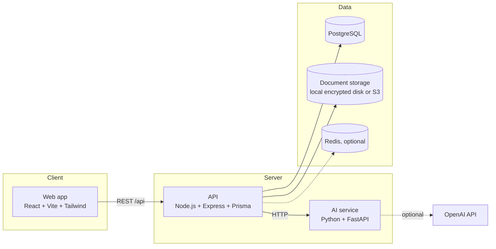
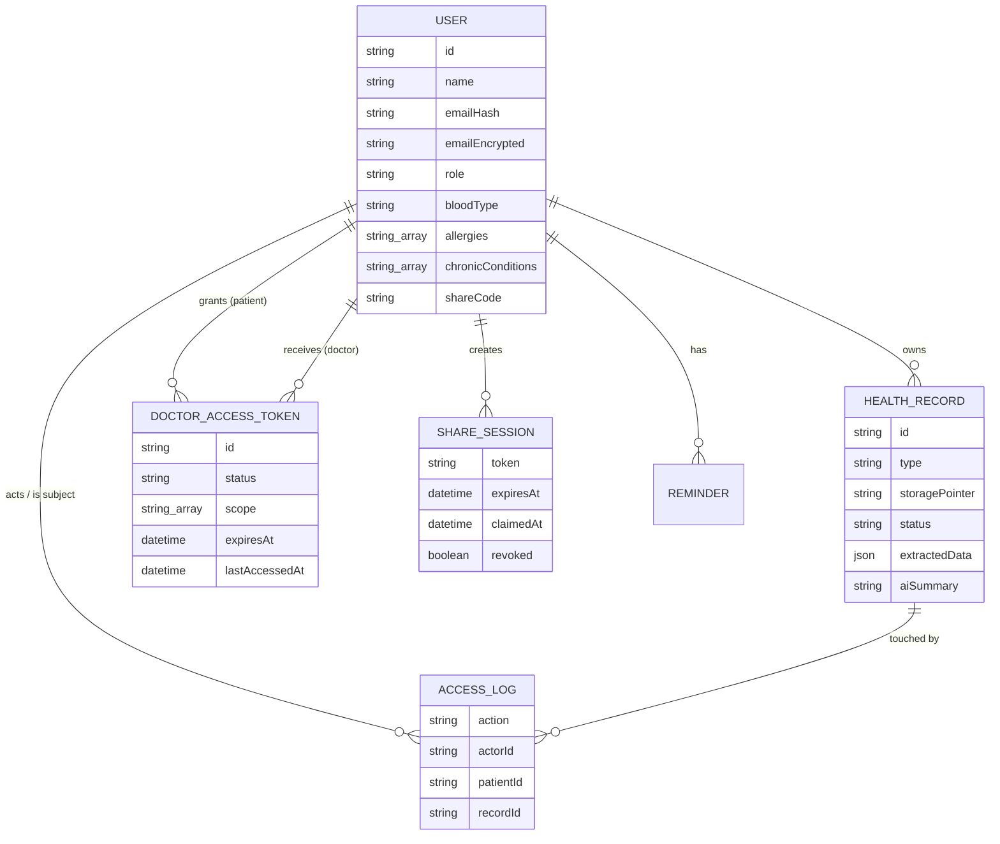
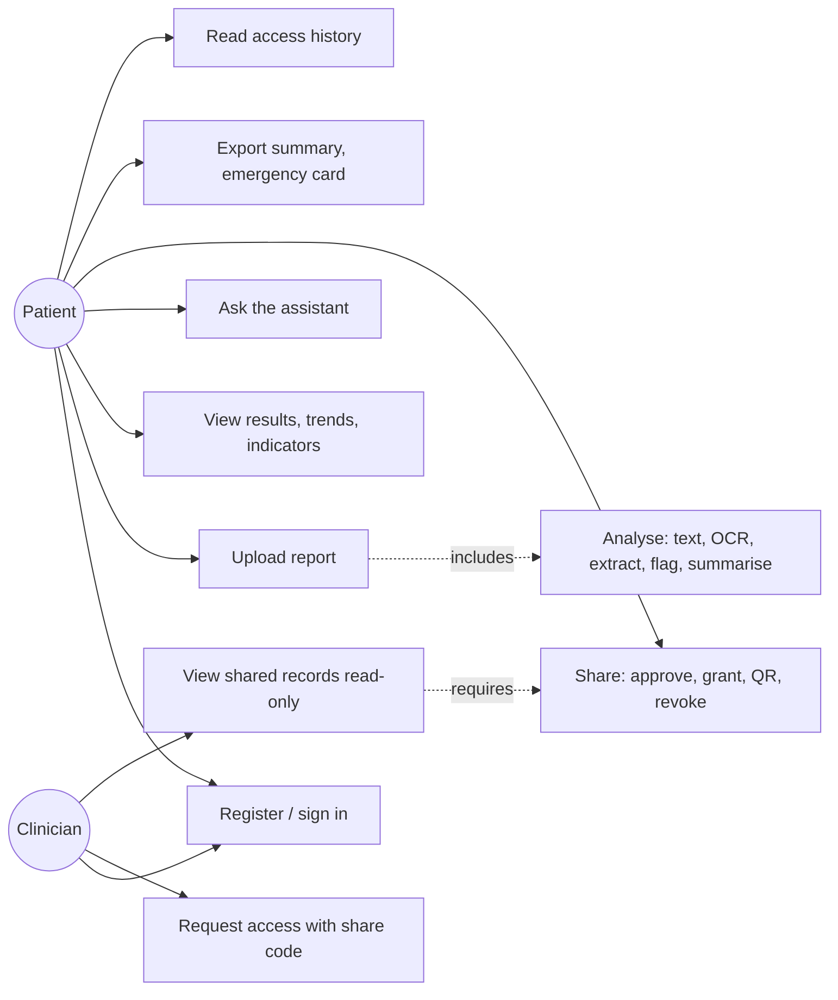
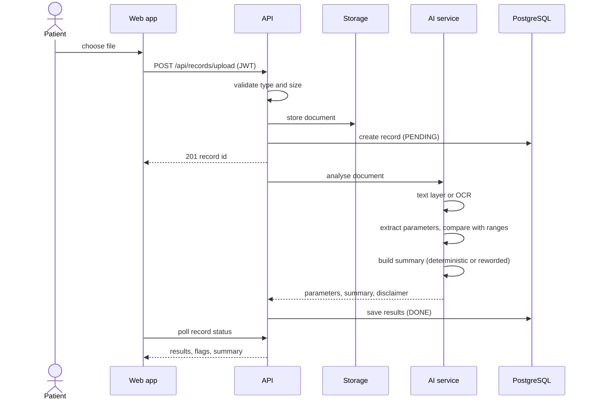
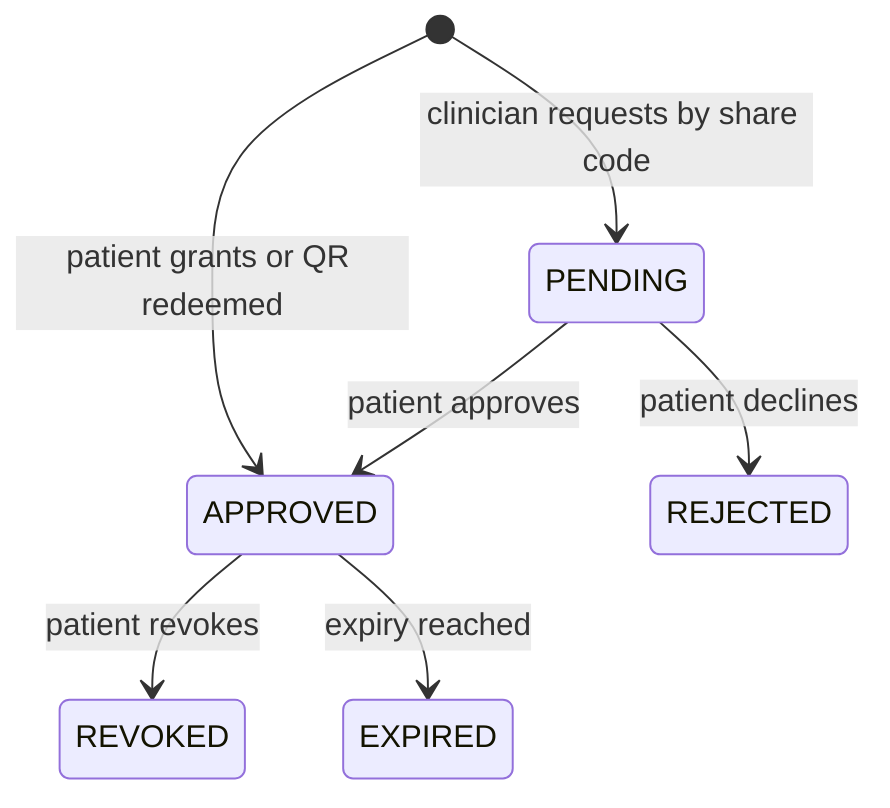
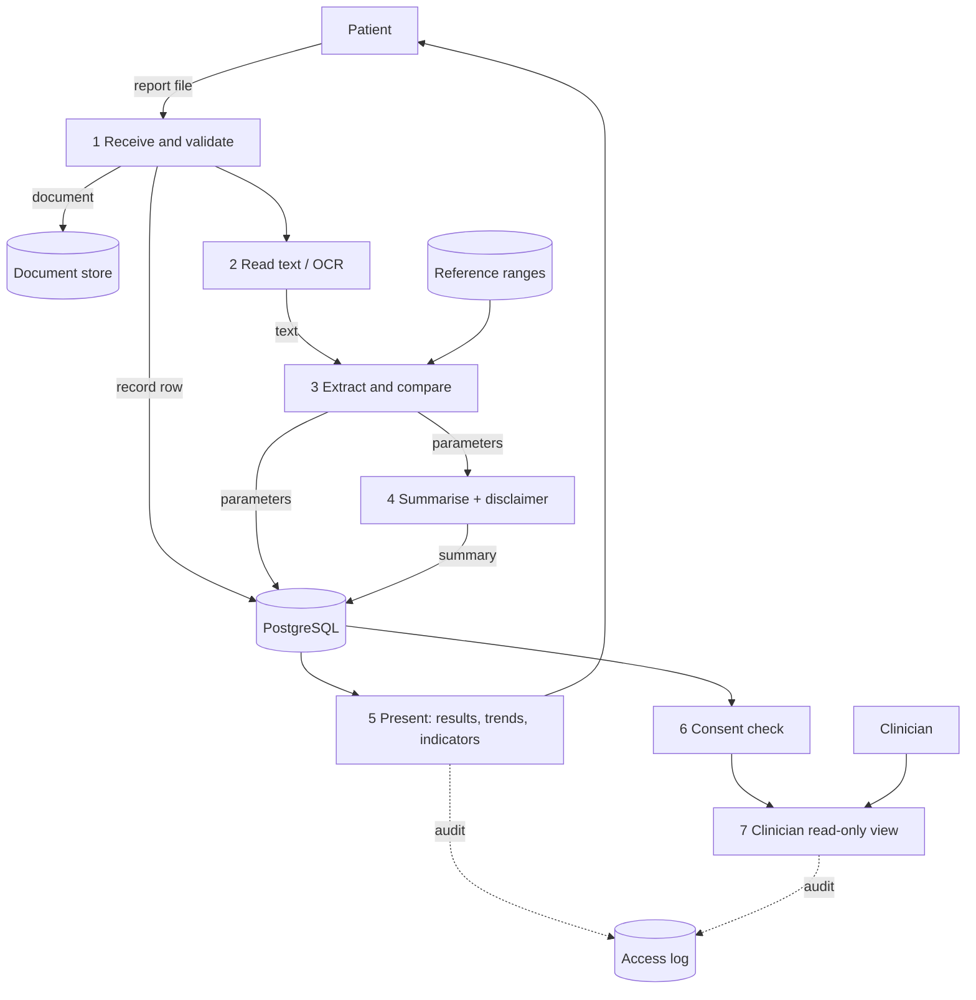

# OneHealth AI — Software Requirements Specification

| | |
|---|---|
| Project | OneHealth AI: Unified Digital Health Profile System (Project No. C77) |
| Programme | B.Tech Computer Engineering, K. J. Somaiya College of Engineering, Somaiya Vidyavihar University |
| Team | Keshav Mallawat, Harsh Shah, Guneesh Singh, Atul Pandey |
| Version | 1.0, 8 October 2026 |
| Status of this document | Describes the system as built. Requirements the build does not meet are marked as such in section 3. |

---

## 1. Introduction

### 1.1 Purpose
This document specifies what OneHealth AI does, for whom, and under which constraints. It is the reference for the final report, the demonstration and the viva.

### 1.2 Scope
OneHealth AI lets a patient keep their medical reports in one place, have laboratory values read out of them automatically, see which values fall outside published reference intervals, read a plain-language explanation, and share selected records with a clinician under the patient's own, revocable consent.

The system is an **informational and decision-support tool. It does not diagnose, prescribe or treat.** Every generated explanation carries a disclaimer.

Out of scope for this release: native mobile applications, payment and subscription billing, integration with the national ABDM registry, delivery of notifications by email or SMS, and production cloud deployment. Section 3.9 lists each with its current state.

### 1.3 Definitions
| Term | Meaning |
|---|---|
| OCR | Optical character recognition: reading text from an image |
| Parameter | One laboratory test the system recognises (14 in this release) |
| Consent | A patient's explicit, time-limited, scoped, revocable permission for one clinician |
| Share code | A patient identifier of the form `OH-XXX-XXX-XXX`, used by a clinician to request access. It is not the patient's email |
| RBAC | Role-based access control (PATIENT, DOCTOR, ADMIN) |
| Watch indicator | A guideline threshold applied to the newest value of a test, worded as "worth keeping an eye on" or "worth discussing with a clinician" |

### 1.4 References
Reference intervals and thresholds are cited in `ai-service/app/data/reference_ranges.py` and `backend/src/services/indicators.service.ts`: Harrison's Principles of Internal Medicine (Appendix), Tietz Textbook of Clinical Chemistry, WHO haemoglobin thresholds, American Diabetes Association Standards of Care, NCEP ATP III.

---

## 2. Overall description

### 2.1 Product perspective
A three-tier web application.

### 2.2 User classes
| User | Description | Main needs |
|---|---|---|
| Patient | Individual who owns records | Upload, understand, track, share, export |
| Clinician | Registered doctor with practice details | Read-only access to records a patient has shared |
| Administrator | Reserved role. Cannot be self-assigned | Not used in this release |

### 2.3 Operating environment
Windows 10/11, macOS or Linux with Node.js 20+, Python 3.10–3.12 (3.13 works without the spaCy engine; the rule-based engine takes over), PostgreSQL 16, and optionally Tesseract 5 and Redis 7. A modern evergreen browser. Containerised deployment files are provided (`infra/docker-compose.prod.yml`).

### 2.4 Design constraints and decisions
1. **Extraction is deterministic, never generated.** Lab values are matched by alias, parsed and compared with fixed intervals. A language model is used, optionally, only to re-word a summary of values already extracted, and its output is discarded if it introduces a number the deterministic draft did not contain.
2. **Fail safe on doubt.** An implausible or possibly misread value is reported as "not compared" instead of being given a confident status.
3. **Nothing is invented.** Demographic and clinical fields are optional and show "Not provided" until the patient enters them. There is no composite health score, because any single number would have to be invented.
4. **PostgreSQL holds structured and extracted data** (as JSON columns), instead of a separate MongoDB. This removes an operational dependency without a functional loss.
5. **Local-first.** The system runs with no cloud account: local encrypted storage, deterministic summaries, in-memory fallback when Redis is absent.

### 2.5 Assumptions
Reports are in English, adult, non-pregnant, and use values the 14 recognised parameters cover. Laboratory-specific reference intervals printed on a report are shown alongside, not substituted.

---

## 3. Functional requirements

Status values: **Met** (built, authorised server-side and covered by an automated test), **Partial** (built with a stated limit), **Not met**. Test names refer to `scripts/smoke-test.js` (core), `scripts/smoke-test-consent.js` (consent), `scripts/smoke-test-features.js` (features) and `ai-service/tests` (ai).

### 3.1 Identity and access
| ID | Requirement | Status | Verified by |
|---|---|---|---|
| FR-1.1 | A person can register as a patient or as a clinician (with speciality, clinic and registration number). ADMIN cannot be self-assigned | Met | consent |
| FR-1.2 | Login issues a 15-minute access token and a 7-day refresh token in an HttpOnly cookie, rotated on use | Met | core |
| FR-1.3 | Passwords are bcrypt-hashed (cost 12). Email and phone are encrypted at rest (AES-256-GCM) with a keyed hash for lookup | Met | core |
| FR-1.4 | Signup, login, consent, QR redemption and assistant requests are rate limited | Met | consent |
| FR-1.5 | Password reset by email | Not met | Needs an outbound mail service |
| FR-1.6 | One-time-password login | Partial | Endpoints exist; delivery is a console stub, so the UI does not offer it |
| FR-1.7 | Google sign-in; authenticator-app two-factor | Not met | Planned |

### 3.2 Patient profile
| ID | Requirement | Status | Verified by |
|---|---|---|---|
| FR-2.1 | A patient can enter date of birth, sex, blood group, allergies, ongoing conditions and an emergency contact. All optional, validated server-side | Met | consent |
| FR-2.2 | A patient has a rotatable share code that is not their email | Met | consent |
| FR-2.3 | An ABHA identifier can be stored and format-checked | Partial | No exchange with the national registry |

### 3.3 Records and the AI pipeline
| ID | Requirement | Status | Verified by |
|---|---|---|---|
| FR-3.1 | Upload PDF, JPEG, PNG, WebP or TIFF; type and size validated in the browser and on the server | Met | core |
| FR-3.2 | Documents are stored behind a driver interface (encrypted local disk, or S3). No unauthenticated URL to a document exists; ownership is re-checked on every request | Met (local), Partial (S3 implemented, not exercised) | core, consent |
| FR-3.3 | Digital PDFs are read from their text layer; scans and images go through OCR | Met | core, ai |
| FR-3.4 | The system extracts 14 laboratory parameters with value, unit, reference interval (sex-specific where one exists), status (NORMAL, LOW, HIGH, UNKNOWN), confidence and the source line | Met | core, ai |
| FR-3.5 | Units are normalised, including Indian lakh notation and `/cumm` counts | Met | ai |
| FR-3.6 | Implausible values, and values next to characters OCR probably misread, are reported UNKNOWN | Met | ai |
| FR-3.7 | A patient-friendly summary with a server-appended medical disclaimer is generated; the UI states whether it was deterministic or model-worded | Met | core |
| FR-3.8 | Processing state is visible (queued, analysing, analysed, failed) and a failed analysis can be retried without losing the upload | Met | core |
| FR-3.9 | Records can be searched, filtered by type, status, tag and date, edited, and soft-deleted, with the audit trail retained | Met | core |
| FR-3.10 | Medications, conditions, procedures and allergies are read from free text, with negation and family-history guards | Met | Rule-based engine and the spaCy + medspaCy engine are both verified (30 tests pass with each, Python 3.12); spaCy has no wheels on Python 3.13 and the rule-based engine takes over |
| FR-3.11 | Scans read by OCR carry a visible "check against your original" notice | Met | build |
| FR-3.12 | Version history of a record; bulk upload | Partial | Up to 10 files can be queued and uploaded in one action (sequential, per-file status). ZIP upload and record versioning are not built |

### 3.4 Dashboard, trends and indicators
| ID | Requirement | Status | Verified by |
|---|---|---|---|
| FR-4.1 | Dashboard shows totals, the latest findings, items needing attention, reminders and recent activity, all computed from stored data | Met | core |
| FR-4.2 | Longitudinal chart per parameter with the reference band, and a plain observation (increased, decreased, stable, newly abnormal, returned to range) | Met | consent |
| FR-4.3 | Two reports can be compared parameter by parameter | Met | consent |
| FR-4.4 | **Watch indicators** compare the newest usable value of each test with cited guideline thresholds (blood sugar, haemoglobin, cholesterol and fats, kidney, thyroid, liver, blood counts). Wording never names a diagnosis; each indicator lists the values and source, and the response carries a disclaimer and a list of what is not assessed | Met | features |
| FR-4.5 | PDF health summary export with the disclaimer on page one | Met | consent |
| FR-4.6 | In-app reminders (create, complete, delete) | Met | consent |
| FR-4.7 | Composite health score | Not met | Deliberately omitted (section 2.4, item 3) |
| FR-4.8 | Blood-pressure-based risk indicators | Not met | Blood pressure is not a laboratory value the system reads |

### 3.5 Health assistant
| ID | Requirement | Status | Verified by |
|---|---|---|---|
| FR-5.1 | A patient can ask questions about their own values; answers are composed deterministically and cite the source report | Met | consent, ai |
| FR-5.2 | Requests for diagnosis, prescription, treatment or prognosis are refused. The refusal check runs before any answer is composed | Met | consent, ai |

### 3.6 Consent and clinician access
| ID | Requirement | Status | Verified by |
|---|---|---|---|
| FR-6.1 | A clinician requests access with the patient's share code; the patient approves, declines or revokes | Met | consent |
| FR-6.2 | A grant is scoped (records, trends, profile) and time-limited (24 h to 30 days); expiry is enforced on every request | Met | consent |
| FR-6.3 | A patient can grant access directly, or generate a single-use, short-lived QR code (5 to 60 minutes) that creates a normal revocable consent | Met | consent |
| FR-6.4 | A clinician sees only patients with a live consent, read-only; write endpoints refuse a clinician | Met | consent |
| FR-6.5 | Every access is logged with actor and subject, and the patient can read the log | Met | consent |
| FR-6.6 | Revocation takes effect on the next request | Met | consent |
| FR-6.7 | Verification of a clinician's registration number against a medical council register | Not met | The number is stored and shown to patients; it is not verified |

### 3.7 Emergency card
| ID | Requirement | Status | Verified by |
|---|---|---|---|
| FR-7.1 | A patient can create a printable QR holding only the details they choose (name, blood group, allergies, conditions, emergency contact), readable offline by any phone camera | Met | features |
| FR-7.2 | The patient is warned that anyone holding the printed code can read it; generation is recorded in the access history | Met | features |

### 3.8 Platform
| ID | Requirement | Status | Verified by |
|---|---|---|---|
| FR-8.1 | CI runs backend typecheck, frontend lint and build, and AI-service checks on every push | Met | CI workflow |
| FR-8.2 | Containers for the three services and a compose file for the whole stack | Partial | Written and validated; images not yet built or deployed |
| FR-8.3 | Public cloud deployment, CDN and web application firewall | Not met | |

### 3.9 Not in this release
Native mobile apps (the web UI is responsive to 390 px but is not an installable PWA); ABDM/ABHA integration; subscription billing; outbound email and SMS; Google Vision fallback OCR; production monitoring and alerting.

---

## 4. Non-functional requirements

| ID | Requirement | Evidence |
|---|---|---|
| NFR-1 Security | OWASP-style controls: RBAC on every protected route, ownership re-checked per request, no stack traces in errors, helmet headers, CORS limited to the configured origin, secrets only from environment | Consent suite asserts the refusals; `config/env.ts` refuses production boot on development secrets |
| NFR-2 Privacy | Consent is explicit, scoped, time-limited and revocable; deletion is soft and indistinguishable from "missing" to others | Consent suite |
| NFR-3 Accuracy | See `docs/EVALUATION.md`: digital PDFs 100% recall and value accuracy on 657 synthetic values; scans measured separately with the silent-wrong rate reported | Benchmark script |
| NFR-4 Performance | Digital PDF analysis about 20 ms in-process; OCR about 3.5 s per page on the test machine; plan target of under 20 s end to end per report is met | Benchmark script |
| NFR-5 Safety | No diagnosis, no treatment advice; every AI-generated explanation and every indicator carries a disclaimer | Features suite |
| NFR-6 Portability | Runs without any cloud account; Windows setup script and container files provided | Setup log |
| NFR-7 Maintainability | TypeScript on both ends of the API boundary, validation with zod, one response envelope, 30 AI-service tests, three end-to-end suites | Test counts |

---

## 5. Data model

`ConsentStatus`: PENDING, APPROVED, REJECTED, REVOKED, EXPIRED. `ProcessStatus`: PENDING, PROCESSING, DONE, FAILED, DELETED.

---

## 6. Behaviour

### 6.1 Use cases

### 6.2 Upload and analysis

### 6.3 Consent

### 6.4 Data flow (level 1)

---

## 7. External interfaces

**Web UI:** responsive down to 390 px; keyboard-operable controls; status never conveyed by colour alone.

**REST API** (JSON envelope `{ success, data, message }`):

| Area | Routes |
|---|---|
| Auth | `POST /api/auth/register`, `login`, `refresh`, `logout`; `GET /api/auth/me` |
| Records | `POST /api/records/upload`; `GET /api/records`, `/:id`, `/:id/file`, `/stats`, `/trends`, `/indicators`, `/compare`, `/activity`, `/summary.pdf`; `POST /:id/reprocess`; `PATCH`, `DELETE /:id` |
| Consent | `GET /api/consents`, `/directory`, `/patients`, `/patients/:id`; `POST /grant`, `/request`, `/:id/approve`, `/reject`, `/revoke` |
| QR sharing | `POST /api/share/sessions`, `/api/share/redeem`; `POST /api/users/me/share-code/rotate` |
| Profile | `GET`, `PATCH /api/users/me/profile`; `GET /api/users/me/emergency-card` |
| Assistant | `POST /api/assistant/ask` |
| Reminders | `/api/reminders` |
| Health | `GET /api/health` |

**AI service:** `POST /api/analyze`, `/api/ocr`, `/api/summarise`, `/api/assistant`; `GET /api/reference-ranges`, `/health`.

**Optional external service:** OpenAI chat completions, used only when a key is configured.

---

## 8. Verification

| Suite | Assertions | What it covers |
|---|---|---|
| `ai-service/tests` | 30 | Extraction, unit conversion, alias collisions, OCR misreads, clinical NER, assistant safety |
| `scripts/smoke-test.js` | 42 | Register, login, upload, analysis, document access control, deletion |
| `scripts/smoke-test-consent.js` | 95 | Consent lifecycle, QR sharing, assistant, trends, export, reminders, rate limits |
| `scripts/smoke-test-features.js` | 29 | Watch indicators, emergency card |
| `scripts/benchmark.py` | 1,090 values | Accuracy and latency on synthetic reports (`docs/EVALUATION.md`) |

Limits of this evidence are stated in `docs/EVALUATION.md`: the test reports are synthetic and written by the project team.
